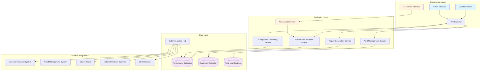
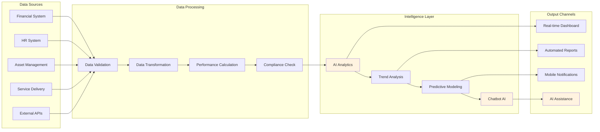
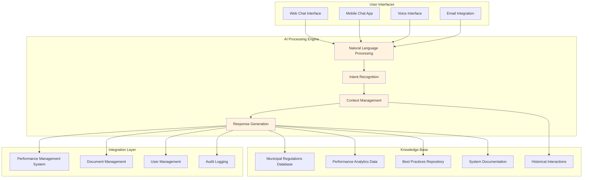
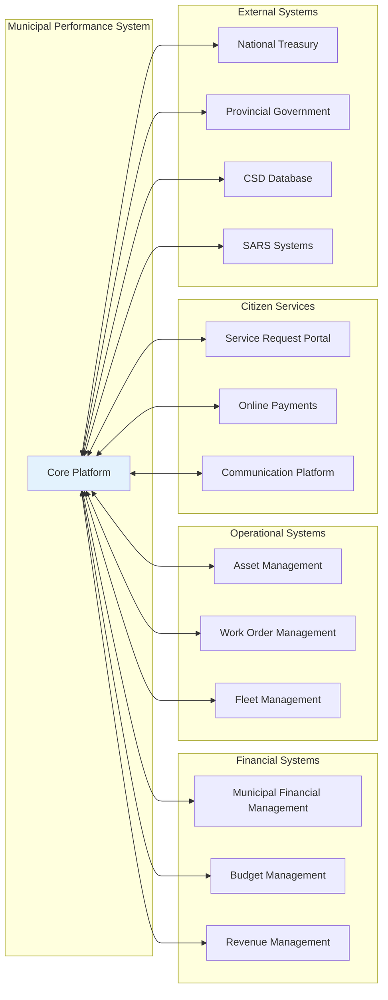
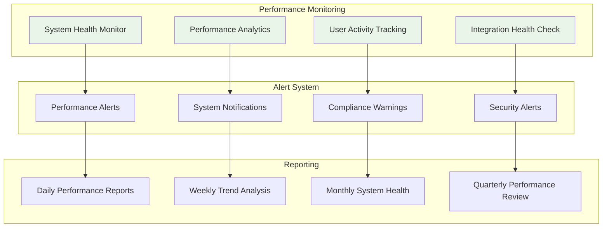

# SYSTEM CAPABILITIES DOCUMENT
## Municipal Performance Management System
**Tender Reference:** [Tender Number]  
**Submitted by:** AllIR Solutions  
**Date:** [Current Date]  
**System:** municipal-performance-management-system

---

## EXECUTIVE SUMMARY

AllIR Solutions proudly presents a revolutionary **Municipal Performance Management System** designed specifically for South African municipal operations. This comprehensive platform transforms how municipalities track, analyze, and manage organizational performance through intelligent automation, real-time monitoring, and AI-powered insights.

Our system addresses the critical need for transparent, accountable, and efficient municipal governance by providing a unified platform that consolidates performance data, ensures regulatory compliance, and delivers actionable insights to drive operational excellence. Built with deep understanding of South African municipal challenges and requirements, this solution empowers local government to achieve their service delivery mandates while maintaining the highest standards of transparency and accountability.

**Key Value Propositions:**
- **Enhanced Transparency:** Real-time public access to municipal performance metrics
- **Regulatory Compliance:** Automated monitoring of statutory requirements and reporting
- **Data-Driven Decisions:** AI-powered analytics for strategic planning and resource optimization
- **Operational Efficiency:** Streamlined processes reducing manual effort by up to 70%
- **Stakeholder Engagement:** Comprehensive reporting for council, provincial, and national oversight

---

## CORE SYSTEM CAPABILITIES

### 📊 **Real-time Municipal KPI Tracking**
Advanced dashboard system providing instant visibility into critical municipal performance indicators including service delivery metrics, financial performance, infrastructure maintenance, and citizen satisfaction scores. The system automatically aggregates data from multiple sources to provide a holistic view of municipal performance.

### 🔄 **Automated Performance Data Collection**
Intelligent data harvesting from existing municipal systems including financial management, asset management, and service delivery platforms. Eliminates manual data entry and ensures data accuracy through automated validation and verification processes.

### 🎛️ **Customizable Departmental Dashboards**
Tailored visualization interfaces for each municipal department (Engineering, Finance, Human Resources, Planning, etc.) with role-specific KPIs, alerts, and reporting capabilities. Each dashboard can be customized to match departmental workflows and priorities.

### ⚖️ **Statutory Compliance Monitoring**
Comprehensive tracking of compliance with Municipal Finance Management Act (MFMA), Municipal Systems Act, and other relevant legislation. Automated alerts ensure timely submission of statutory reports and compliance documentation.

### 🔐 **Multi-level User Access Control**
Sophisticated permission management system supporting municipal hierarchy from ward councillors to municipal managers. Role-based access ensures data security while providing appropriate visibility at each organizational level.

### 📋 **Automated Report Generation**
Intelligent report generation for monthly, quarterly, and annual submissions to National Treasury, Provincial Government, and other oversight bodies. Templates comply with standard government reporting formats and requirements.

### 📈 **Performance Trend Analysis**
Advanced analytics engine identifying performance trends, seasonal patterns, and anomalies. Predictive modeling helps municipalities anticipate challenges and plan proactive interventions.

### 🚨 **Alert System for Performance Thresholds**
Proactive notification system monitoring critical performance indicators and compliance deadlines. Customizable alert thresholds ensure timely intervention when performance deviates from targets.

### 📋 **CSD Registration Compliance Tracking**
Automated monitoring of Central Supplier Database registration requirements, ensuring all suppliers and contractors maintain current registrations and comply with BBBEE and tax requirements.

### 📱 **Mobile-Responsive Interface**
Fully responsive design enabling access from any device, supporting field-based workers and mobile council members. Progressive Web App (PWA) technology ensures optimal performance even with limited connectivity.

### 📤 **Data Export Capabilities**
Flexible data export functionality supporting multiple formats (Excel, PDF, CSV, XML) for integration with external systems and ad-hoc analysis requirements.

### 🔗 **Integration with Existing Municipal Systems**
Seamless integration capabilities with popular municipal software including financial management systems, asset management platforms, and citizen service portals through standardized APIs and data connectors.

### 🏆 **Performance Benchmarking**
Comparative analysis against similar municipalities and national performance standards. Benchmarking dashboard highlights areas of excellence and opportunities for improvement.

### 🎯 **Goal Setting and Tracking**
Comprehensive goal management system supporting SMART objectives aligned with Integrated Development Plans (IDP) and Service Delivery Budget Implementation Plans (SDBIP).

### 📋 **Audit Trail and Logging**
Complete audit trail of all system activities ensuring transparency and accountability. Immutable logging supports internal audits and external oversight requirements.

---

## SYSTEM ARCHITECTURE



## DATA FLOW DIAGRAM



---

## AI-POWERED PERFORMANCE ASSISTANT

### 🤖 **Intelligent Municipal Advisor**

Our integrated AI chatbot represents a breakthrough in municipal management support, providing 24/7 intelligent assistance to municipal staff, councillors, and management teams.

#### **Core AI Capabilities:**

**📊 KPI Interpretation & Analysis**
- Explains complex performance calculations in plain language
- Provides context for performance variances and trends
- Suggests actionable insights based on data patterns
- Compares current performance against historical benchmarks

**⚖️ Compliance Guidance**
- Real-time updates on regulatory changes affecting municipalities
- Guided assistance for statutory reporting requirements
- Proactive compliance risk identification and mitigation strategies
- Step-by-step guidance for regulatory submission processes

**📋 Intelligent Report Generation**
- Natural language report generation from performance data
- Executive summary creation for council and management briefings
- Automated narrative explanations of performance trends
- Customized reporting for different stakeholder groups

**📈 Performance Optimization**
- Evidence-based recommendations for performance improvement
- Resource allocation optimization suggestions
- Best practice identification from benchmarking data
- Strategic planning support based on predictive analytics

**🎓 System Navigation & Training**
- Interactive system tutorials and feature explanations
- Contextual help based on user roles and permissions
- Troubleshooting assistance and technical support
- Continuous learning adaptation to user behavior patterns

#### **AI Assistant Architecture**



---

## SYSTEM INTEGRATION CAPABILITIES

### 🔗 **Seamless Municipal Ecosystem Integration**

Our platform is designed for seamless integration with existing municipal infrastructure, minimizing disruption while maximizing value.

#### **Integration Architecture**



#### **Integration Methods:**
- **RESTful APIs** for real-time data exchange
- **SOAP Web Services** for legacy system compatibility
- **Database connectors** for direct data access
- **File-based integration** for batch processing
- **Event-driven architecture** for real-time notifications

---

## PERFORMANCE EXPECTATIONS

### 📈 **Quantified System Performance Metrics**

| Metric Category | Performance Target | Measurement Method |
|-----------------|-------------------|-------------------|
| **System Availability** | 99.9% uptime | Automated monitoring |
| **Response Time** | <2 seconds for dashboard loading | Performance testing |
| **Data Processing** | Real-time updates within 5 minutes | Transaction logging |
| **Report Generation** | <30 seconds for standard reports | Benchmark testing |
| **User Satisfaction** | >95% satisfaction rating | User surveys |
| **Data Accuracy** | 99.95% accuracy rate | Validation audits |
| **Mobile Performance** | <3 seconds on 3G networks | Mobile testing |
| **AI Response Time** | <5 seconds for chatbot responses | Response analytics |

### 🎯 **Business Impact Metrics**

| Impact Area | Expected Improvement | Timeline |
|-------------|---------------------|----------|
| **Report Generation Time** | 70% reduction | Month 3 |
| **Data Quality** | 85% improvement | Month 6 |
| **Compliance Adherence** | 95% on-time submissions | Month 12 |
| **Decision Making Speed** | 50% faster | Month 18 |
| **Resource Optimization** | 15% efficiency gain | Month 24 |
| **Citizen Satisfaction** | 20% improvement | Month 36 |

### 📊 **Performance Monitoring Dashboard**



---

## GOVERNMENT STANDARDS COMPLIANCE

### 🔒 **Protection of Personal Information Act (POPIA) Compliance**

Our system demonstrates full commitment to data protection and privacy rights:

#### **Data Protection Measures:**
- **Data Minimization:** Collection limited to performance management purposes
- **Consent Management:** Clear consent mechanisms for personal data processing
- **Access Controls:** Role-based access ensuring data access on need-to-know basis
- **Data Retention:** Automated data lifecycle management with compliant retention schedules
- **Breach Response:** Automated incident response with 72-hour notification capability
- **Audit Trails:** Complete logging of data access and processing activities

#### **Technical Safeguards:**
- AES-256 encryption for data at rest
- TLS 1.3 for data in transit
- Multi-factor authentication
- Regular security vulnerability assessments
- Automated backup and disaster recovery

### ♿ **Digital Accessibility Standards**

Full compliance with Web Content Accessibility Guidelines (WCAG) 2.1 AA:

#### **Accessibility Features:**
- **Screen Reader Compatibility:** Full ARIA label implementation
- **Keyboard Navigation:** Complete keyboard-only navigation support
- **Visual Impairment Support:** High contrast modes and scalable text
- **Cognitive Accessibility:** Simple navigation and clear information hierarchy
- **Mobile Accessibility:** Touch-friendly interfaces with appropriate target sizes

#### **Compliance Testing:**
- Automated accessibility testing in development pipeline
- Manual testing with assistive technologies
- User acceptance testing with disabled users
- Regular accessibility audits and remediation

### 📋 **Government IT Standards**

#### **Security Framework Alignment:**
- **COBIT Framework:** IT governance and management compliance
- **ISO 27001:** Information security management system certification
- **NIST Cybersecurity Framework:** Risk-based approach to security
- **SANS Critical Security Controls:** Implementation of essential security measures

#### **Data Standards:**
- **SADC e-Government Standards:** Regional interoperability compliance
- **Government Data Architecture:** Alignment with national data standards
- **Open Data Formats:** Support for government open data initiatives

---

## IMPLEMENTATION ROADMAP

### 🗓️ **3-Year Implementation Strategy**

```mermaid
gantt
    title Municipal Performance Management System Implementation
    dateFormat  YYYY-MM-DD
    section Phase 1 - Foundation
    System Setup & Core Config    :p1-1, 2024-01-01, 90d
    User Management & Security    :p1-2, after p1-1, 60d
    Basic KPI Tracking           :p1-3, after p1-2, 45d
    
    section Phase 2 - Core Features
    Advanced Analytics           :p2-1, after