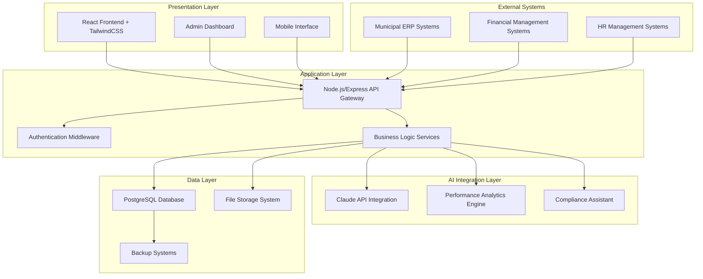
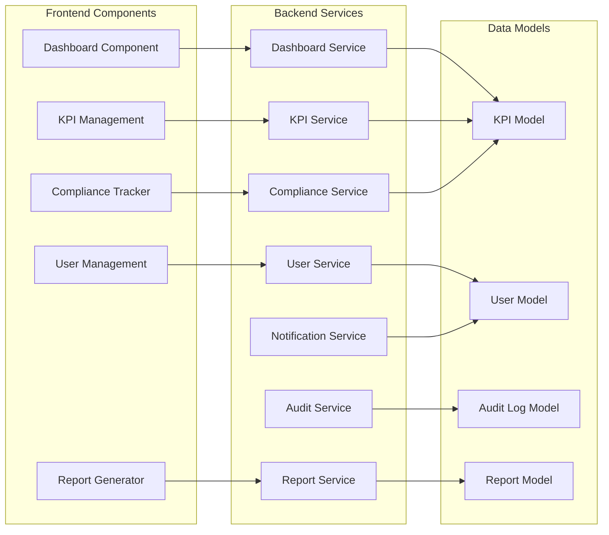
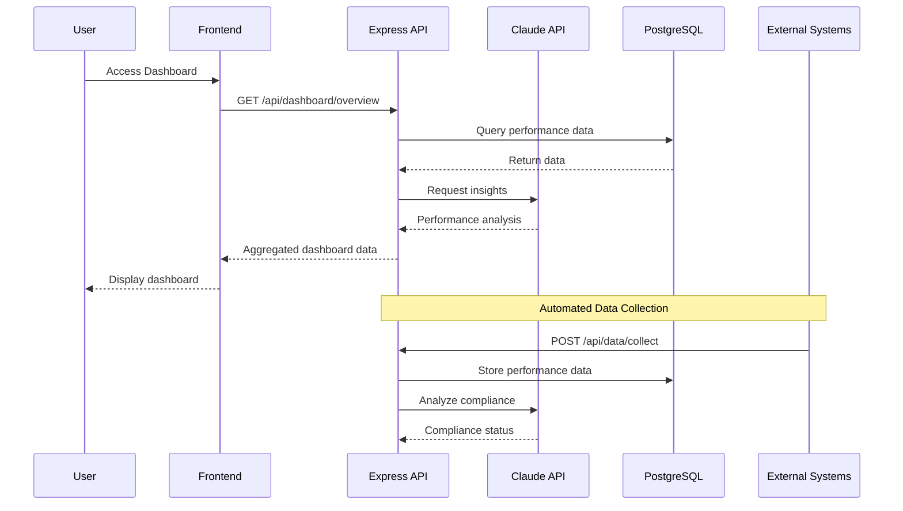

# Municipal Performance Management System
## Technical Manual

**Version:** 1.0  
**Date:** December 2024  
**Classification:** RESTRICTED  
**Prepared for:** South African Government Tender Submission

---

## Table of Contents

1. [Executive Summary](#1-executive-summary)
2. [System Architecture](#2-system-architecture)
3. [Technology Stack](#3-technology-stack)
4. [Module Documentation](#4-module-documentation)
5. [API Reference](#5-api-reference)
6. [Database Schema](#6-database-schema)
7. [Deployment Guide](#7-deployment-guide)
8. [Security Considerations](#8-security-considerations)
9. [Monitoring & Maintenance](#9-monitoring--maintenance)
10. [Backup & Recovery](#10-backup--recovery)
11. [Compliance & Standards](#11-compliance--standards)

---

## 1. Executive Summary

The Municipal Performance Management System (MPMS) is a comprehensive digital platform designed to enhance municipal governance through real-time performance monitoring, automated compliance tracking, and intelligent reporting capabilities. Built specifically for South African municipalities, the system aligns with the Municipal Systems Act and Municipal Finance Management Act requirements.

### 1.1 Key Features

- **Real-time KPI Dashboard**: Executive-level performance visualization
- **Automated Compliance Tracking**: Regulatory requirement monitoring
- **AI-Powered Insights**: Claude API integration for intelligent analysis
- **Comprehensive Audit Trail**: Full system activity logging
- **Multi-departmental Integration**: Cross-functional performance management
- **Statutory Reporting**: Automated generation of required reports

### 1.2 System Benefits

- Improved municipal transparency and accountability
- Enhanced decision-making through data-driven insights
- Reduced manual reporting overhead
- Proactive compliance management
- Streamlined performance monitoring processes

---

## 2. System Architecture

### 2.1 High-Level Architecture



### 2.2 Component Architecture



### 2.3 Data Flow Architecture



---

## 3. Technology Stack

### 3.1 Frontend Technologies

| Technology | Version | Purpose |
|------------|---------|---------|
| React | 18.2.0 | User interface framework |
| TailwindCSS | 3.3.0 | CSS styling framework |
| Axios | 1.6.0 | HTTP client for API calls |
| Chart.js | 4.4.0 | Data visualization |
| React Router | 6.8.0 | Client-side routing |

### 3.2 Backend Technologies

| Technology | Version | Purpose |
|------------|---------|---------|
| Node.js | 20.x LTS | JavaScript runtime |
| Express.js | 4.18.0 | Web application framework |
| JWT | 9.0.0 | Authentication tokens |
| bcryptjs | 2.4.3 | Password hashing |
| Helmet | 7.1.0 | Security middleware |

### 3.3 Database & Storage

| Technology | Version | Purpose |
|------------|---------|---------|
| PostgreSQL | 15.x | Primary database |
| Redis | 7.x | Caching and sessions |
| MinIO | Latest | File storage |

### 3.4 AI & Analytics

| Service | Purpose |
|---------|---------|
| Claude API | Performance insights and compliance analysis |
| Custom Analytics Engine | KPI calculations and trending |

### 3.5 DevOps & Deployment

| Technology | Version | Purpose |
|------------|---------|---------|
| Docker | 24.x | Containerization |
| Docker Compose | 2.21.0 | Multi-container orchestration |
| Nginx | 1.25.0 | Reverse proxy and load balancer |
| PM2 | 5.3.0 | Process management |

---

## 4. Module Documentation

### 4.1 Dashboard Module

**Purpose**: Executive dashboard with real-time KPI visualization and municipal performance overview

**Key Components**:
- `src/components/Dashboard.js`
- `src/services/dashboardService.js`

**Features**:
- Real-time performance metrics
- Interactive KPI visualizations
- Departmental performance comparison
- Alert notifications
- Executive summary reports

**API Integration**:
```javascript
// Dashboard Service Example
class DashboardService {
  async getPerformanceOverview() {
    return await api.get('/api/dashboard/overview');
  }
  
  async getKPITrends(timeframe) {
    return await api.get(`/api/dashboard/trends/${timeframe}`);
  }
}
```

### 4.2 KPI Management Module

**Purpose**: Define, configure, and manage municipal KPIs across departments

**Key Components**:
- `src/components/KPIManagement.js`
- `src/models/KPI.js`

**Features**:
- KPI definition and configuration
- Target setting and threshold management
- Department-specific KPI assignment
- Performance calculation methods
- Historical KPI tracking

**KPI Model Structure**:
```javascript
const KPISchema = {
  id: 'UUID',
  name: 'String',
  description: 'Text',
  department: 'String',
  category: 'Enum',
  target: 'Numeric',
  unit: 'String',
  calculation_method: 'Text',
  frequency: 'Enum',
  is_active: 'Boolean',
  created_at: 'Timestamp',
  updated_at: 'Timestamp'
};
```

### 4.3 Data Collection Module

**Purpose**: Automated data collection from municipal systems and manual data entry

**Key Components**:
- `src/services/dataCollector.js`
- `src/components/DataEntry.js`

**Features**:
- Automated system integration
- Manual data entry interfaces
- Data validation and verification
- Import/export capabilities
- Data quality checks

**Data Collection Process**:
```javascript
class DataCollector {
  async collectFromERP() {
    // Automated ERP integration
  }
  
  async validateData(data) {
    // Data quality validation
  }
  
  async storePerformanceData(data) {
    // Store validated data
  }
}
```

### 4.4 Reporting Module

**Purpose**: Generate statutory reports, performance reports, and compliance documentation

**Key Components**:
- `src/components/ReportGenerator.js`
- `src/services/reportService.js`

**Features**:
- Automated report generation
- Custom report templates
- Scheduled report delivery
- Multiple output formats (PDF, Excel, CSV)
- Statutory compliance reports

### 4.5 User Management Module

**Purpose**: Role-based access control for municipal staff and external stakeholders

**Key Components**:
- `src/components/UserManagement.js`
- `src/middleware/auth.js`

**Features**:
- Role-based permissions
- Department-based access control
- User lifecycle management
- Security policy enforcement
- Activity monitoring

**Role Hierarchy**:
```
System Administrator
├── Municipal Manager
│   ├── Department Head
│   │   ├── Section Manager
│   │   └── Data Capturer
│   └── Performance Analyst
└── External Auditor (Read-only)
```

### 4.6 Compliance Tracking Module

**Purpose**: Track municipal compliance with regulations and performance standards

**Key Components**:
- `src/components/ComplianceTracker.js`
- `src/services/complianceService.js`

**Features**:
- Regulatory requirement tracking
- Compliance status monitoring
- Deadline management
- Risk assessment
- Remedial action tracking

### 4.7 Notifications Module

**Purpose**: Automated alerts for performance thresholds, deadlines, and compliance issues

**Key Components**:
- `src/services/notificationService.js`
- `src/components/Notifications.js`

**Features**:
- Real-time alert system
- Email and SMS notifications
- Escalation procedures
- Custom notification rules
- Notification history

### 4.8 Audit Trail Module

**Purpose**: Comprehensive logging and audit trail for all system activities

**Key Components**:
- `src/services/auditService.js`
- `src/models/AuditLog.js`

**Features**:
- Complete activity logging
- Data modification tracking
- User action monitoring
- Compliance audit support
- Forensic analysis capabilities

---

## 5. API Reference

### 5.1 Authentication Endpoints

#### Login
```http
POST /api/auth/login
Content-Type: application/json

{
  "username": "string",
  "password": "string"
}
```

**Response**:
```json
{
  "token": "jwt_token",
  "user": {
    "id": "uuid",
    "username": "string",
    "role": "string",
    "department": "string"
  },
  "expires_in": 3600
}
```

### 5.2 Dashboard Endpoints

#### Get Performance Overview
```http
GET /api/dashboard/overview
Authorization: Bearer {token}
```

**Response**:
```json
{
  "overview": {
    "total_kpis": 45,
    "on_target": 32,
    "at_risk": 8,
    "off_target": 5
  },
  "departmental_summary": [
    {
      "department": "Water Services",
      "performance_score": 85.2,
      "kpi_count": 12,
      "status": "good"
    }
  ],
  "recent_alerts": [
    {
      "id": "uuid",
      "message": "Water quality KPI below threshold",
      "severity": "high",
      "created_at": "2024-12-08T10:30:00Z"
    }
  ]
}
```

### 5.3 KPI Management Endpoints

#### Create KPI
```http
POST /api/kpis
Authorization: Bearer {token}
Content-Type: application/json

{
  "name": "Water Quality Compliance",
  "description": "Percentage of water samples meeting quality standards",
  "department": "water_services",
  "category": "service_delivery",
  "target": 95.0,
  "unit": "percentage",
  "frequency": "monthly"
}
```

#### Update KPI
```http
PUT /api/kpis/{id}
Authorization: Bearer {token}
Content-Type: application/json

{
  "target": 98.0,
  "description": "Updated description"
}
```

#### Get Department KPIs
```http
GET /api/kpis/department/{department}
Authorization: Bearer {token}
```

### 5.4 Data Collection Endpoints

#### Submit Performance Data
```http
POST /api/data/collect
Authorization: Bearer {token}
Content-Type: application/json

{
  "kpi_id": "uuid",
  "value": 87.5,
  "period": "2024-11",
  "source": "automated",
  "verified": true
}
```

### 5.5 Reporting Endpoints

#### Generate Report
```http
GET /api/reports/generate/{type}?period=2024-Q4&format=pdf
Authorization: Bearer {token}
```

**Parameters**:
- `type`: quarterly, annual, compliance, custom
- `period`: Reporting period
- `format`: pdf, excel, csv

### 5.6 Compliance Endpoints

#### Get Compliance Status
```http
GET /api/compliance/status
Authorization: Bearer {token}
```

**Response**:
```json
{
  "overall_compliance": 92.5,
  "areas": [
    {
      "area": "Financial Management",
      "compliance_score": 95.2,
      "status": "compliant",
      "last_assessment": "2024-12-01"
    },
    {
      "area": "Service Delivery",
      "compliance_score": 88.7,
      "status": "at_risk",
      "issues": [
        {
          "description": "Water service delivery below standard",
          "severity": "medium",
          "due_date": "2024-12-15"
        }
      ]
    }
  ]
}
```

### 5.7 User Management Endpoints

#### Create User
```http
POST /api/users
Authorization: Bearer {token}
Content-Type: application/json

{
  "username": "jdoe",
  "email": "john.doe@municipality.gov.za",
  "role": "department_head",
  "department": "water_services",
  "permissions": ["read_kpis", "write_data", "generate_reports"]
}
```

### 5.8 Notification Endpoints

#### Get Pending Notifications
```http
GET /api/notifications/pending
Authorization: Bearer {token}
```

### 5.9 Audit Trail Endpoints

#### Get Audit Trail
```http
GET /api/audit/trail/{entity}?start_date=2024-12-01&end_date=2024-12-08
Authorization: Bearer {token}
```

---

## 6. Database Schema

### 6.1 Core Tables

#### Users Table
```sql
CREATE TABLE users (
    id UUID PRIMARY KEY DEFAULT gen_random_uuid(),
    username VARCHAR(50) UNIQUE NOT NULL,
    email VARCHAR(100) UNIQUE NOT NULL,
    password_hash VARCHAR(255) NOT NULL,
    role VARCHAR(50) NOT NULL,
    department VARCHAR(100),
    is_active BOOLEAN DEFAULT TRUE,
    last_login TIMESTAMP,
    created_at TIMESTAMP DEFAULT CURRENT_TIMESTAMP