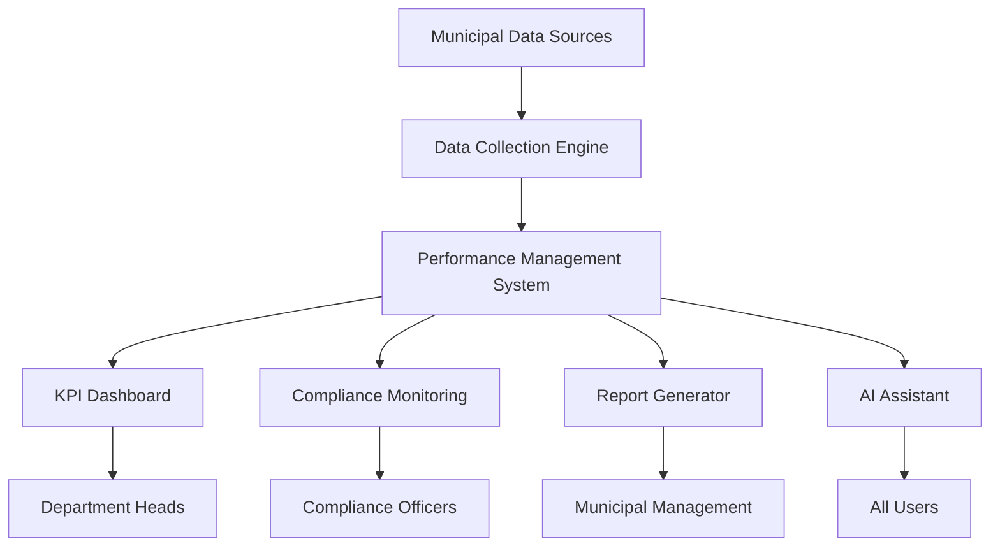
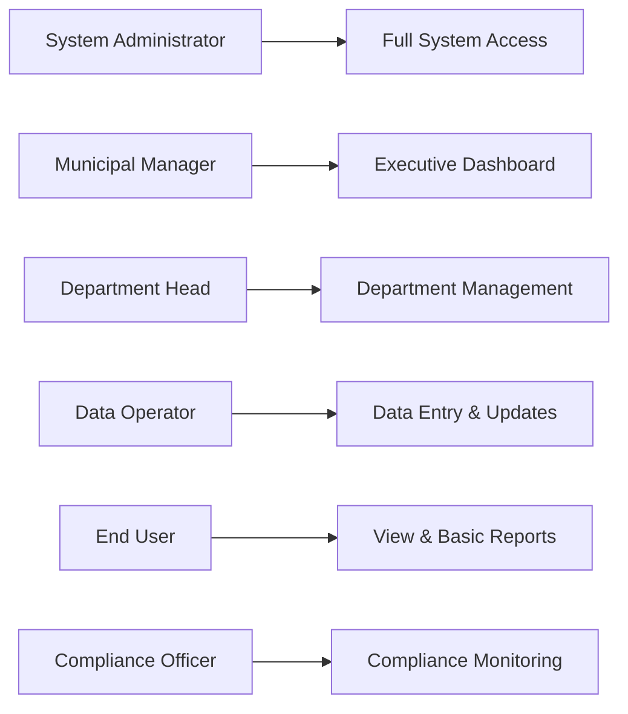
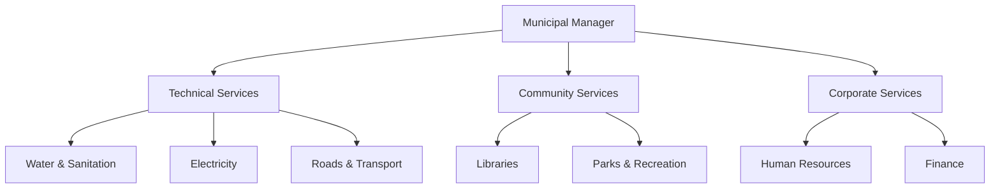
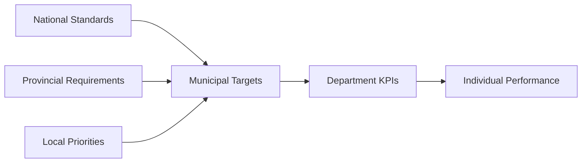

# Municipal Performance Management System
## User Manual

**Version 1.0**  
**Document Date:** December 2024  
**Document Classification:** For Official Use  

---

## Table of Contents

1. [Introduction & Purpose](#1-introduction--purpose)
2. [Getting Started](#2-getting-started)
3. [Admin User Guide](#3-admin-user-guide)
4. [Operator Guide](#4-operator-guide)
5. [End-User Guide](#5-end-user-guide)
6. [AI Assistant Usage](#6-ai-assistant-usage)
7. [Troubleshooting](#7-troubleshooting)
8. [Frequently Asked Questions](#8-frequently-asked-questions)

---

## 1. Introduction & Purpose

### 1.1 System Overview

The Municipal Performance Management System (MPMS) is a comprehensive automated performance management solution designed specifically for South African municipal operations. This system enables municipalities to effectively track, analyze, and manage organizational Key Performance Indicators (KPIs), departmental metrics, and statutory compliance standards.

### 1.2 Purpose and Benefits

**Primary Objectives:**
- Streamline municipal performance monitoring and reporting
- Ensure compliance with South African municipal regulations
- Provide real-time insights into departmental performance
- Automate data collection and report generation
- Support evidence-based decision making

**Key Benefits:**
- **Compliance Assurance:** Automated monitoring of statutory requirements including CSD registration compliance
- **Efficiency Gains:** Reduced manual data processing and report generation time
- **Transparency:** Clear visibility of performance metrics across all municipal departments
- **Accountability:** Comprehensive audit trails and performance tracking
- **Data-Driven Decisions:** Real-time analytics and trend analysis capabilities

### 1.3 System Architecture

### 1.4 Compliance Framework

The system supports compliance with key South African municipal legislation:
- Municipal Finance Management Act (MFMA)
- Municipal Systems Act
- Division of Revenue Act (DORA)
- Central Supplier Database (CSD) requirements
- National Treasury regulations
- Provincial oversight requirements

---

## 2. Getting Started

### 2.1 System Requirements

**Supported Browsers:**
- Google Chrome (Recommended)
- Mozilla Firefox
- Microsoft Edge
- Safari (mobile devices)

**Network Requirements:**
- Stable internet connection
- Minimum 1 Mbps bandwidth per concurrent user

**Mobile Compatibility:**
- Android 7.0 or higher
- iOS 12.0 or higher

### 2.2 Initial Access

**Step 1: Obtain Login Credentials**
Contact your Municipal IT Administrator to obtain:
- Username
- Temporary password
- System URL

**Step 2: First Login**
1. Navigate to the system URL provided
2. Enter your username and temporary password
3. Complete the mandatory password change
4. Accept the terms of use
5. Complete your user profile

**Step 3: Dashboard Orientation**
Upon successful login, you will see your personalized dashboard based on your role and department.

### 2.3 User Roles and Permissions

**Role Definitions:**

| Role | Responsibilities | Access Level |
|------|-----------------|--------------|
| System Administrator | System configuration, user management | Full access |
| Municipal Manager | Strategic oversight, executive reporting | High-level analytics |
| Department Head | Department performance management | Department-specific data |
| Data Operator | Data entry, validation, updates | Operational data access |
| End User | View reports, basic analytics | Read-only access |
| Compliance Officer | Monitor compliance, generate compliance reports | Compliance-focused access |

### 2.4 Navigation Overview

**Main Navigation Elements:**
- **Dashboard:** Real-time performance overview
- **KPIs:** Key Performance Indicator management
- **Reports:** Automated and custom report generation
- **Compliance:** Statutory compliance monitoring
- **Data Management:** Data entry and validation tools
- **Settings:** User preferences and system configuration
- **Help:** AI Assistant and documentation access

---

## 3. Admin User Guide

### 3.1 System Configuration

**Initial System Setup**

**Step 1: Municipal Profile Configuration**
1. Navigate to **Settings > Municipal Profile**
2. Enter complete municipal details:
   - Municipality name and code
   - Physical and postal addresses
   - Contact information
   - Mayor and Municipal Manager details
   - Population and demographic data

**Step 2: Department Structure Setup**
1. Go to **Settings > Departments**
2. Create department hierarchy:
   - Add main departments (e.g., Water & Sanitation, Roads & Transport)
   - Define sub-departments and units
   - Assign budget codes and cost centers
   - Set reporting relationships

**Step 3: KPI Framework Configuration**
1. Access **Settings > KPI Management**
2. Configure municipal KPIs:
   - Service delivery indicators
   - Financial performance metrics
   - Governance indicators
   - Infrastructure metrics

### 3.2 User Management

**Creating User Accounts**

1. Navigate to **Administration > User Management**
2. Click **Add New User**
3. Complete user details:
   - Personal information
   - Employee number
   - Department assignment
   - Role assignment
   - Contact details

**Setting User Permissions**

| Permission Level | Description | Typical Users |
|------------------|-------------|---------------|
| View Only | Read-only access to assigned data | General staff |
| Data Entry | Can input and modify operational data | Data clerks, supervisors |
| Department Management | Full access to department data | Department heads |
| Compliance Management | Access to compliance functions | Compliance officers |
| System Administration | Full system access | IT administrators |

**Bulk User Import**
For large-scale implementations:
1. Download the user template: **Administration > User Management > Download Template**
2. Complete the Excel template with user information
3. Upload via **Administration > User Management > Bulk Import**

### 3.3 System Integration

**Connecting External Systems**

**Financial Management System Integration**
1. Navigate to **Settings > Integrations > Financial Systems**
2. Configure connection parameters:
   - System type (SAP, Sage, Municipal accounting system)
   - Connection credentials
   - Data mapping configuration
   - Synchronization schedule

**SCADA System Integration**
For technical services departments:
1. Go to **Settings > Integrations > SCADA Systems**
2. Configure real-time data feeds:
   - Water treatment plant data
   - Electricity distribution metrics
   - Sewage treatment performance

**Central Supplier Database (CSD) Integration**
1. Access **Settings > Compliance > CSD Integration**
2. Configure automatic compliance checking:
   - CSD registration verification
   - Supplier status monitoring
   - Compliance alert generation

### 3.4 Performance Monitoring Setup

**Defining Performance Standards**

**Setting Alert Thresholds**
1. Navigate to **Settings > Alert Management**
2. Configure performance thresholds:
   - Green zone: Above target performance
   - Amber zone: Below target but within acceptable range
   - Red zone: Critical performance requiring immediate attention

### 3.5 Backup and Maintenance

**Automated Backup Configuration**
1. Access **Administration > System Maintenance > Backup Settings**
2. Configure backup schedules:
   - Daily operational backups
   - Weekly full system backups
   - Monthly archive backups

**System Health Monitoring**
- Monitor system performance via **Administration > System Health**
- Review error logs and performance metrics
- Schedule regular maintenance windows

---

## 4. Operator Guide

### 4.1 Data Entry and Management

**Daily Data Entry Procedures**

**Step 1: Accessing Data Entry Screens**
1. Log into the system
2. Navigate to **Data Management > Daily Entry**
3. Select your department and date range

**Step 2: Service Delivery Data Entry**

**Water Services Data:**
- Water production volumes
- Water quality test results
- System pressure readings
- Maintenance activities completed
- Customer complaints resolved

**Electricity Services Data:**
- Power generation/distribution
- Outage incidents and duration
- Maintenance activities
- Customer connections

**Waste Management Data:**
- Waste collection tonnage
- Recycling volumes
- Vehicle utilization rates
- Customer complaints

**Step 3: Data Validation**
The system automatically validates entered data:
- Range checks (e.g., water pressure within normal limits)
- Consistency checks (e.g., total collection vs. route data)
- Completeness verification

### 4.2 Real-time Monitoring

**Dashboard Management**

**Creating Custom Dashboards**
1. Navigate to **Dashboards > Create New**
2. Select relevant KPIs for your role:
   - Department-specific metrics
   - Cross-departmental indicators
   - Compliance status indicators
3. Arrange widgets for optimal viewing
4. Save and name your dashboard

**Key Widgets Available:**
- Performance trend charts
- Traffic light indicators (Red/Amber/Green status)
- Comparison charts (current vs. target vs. previous period)
- Real-time data feeds
- Alert notifications

### 4.3 Quality Assurance

**Data Quality Procedures**

**Daily Quality Checks:**
1. Review data entry completeness via **Data Management > Quality Dashboard**
2. Verify automated data feeds are functioning
3. Investigate and resolve data anomalies
4. Update data correction logs

**Monthly Quality Reports:**
- Generate data quality summary reports
- Document data issues and resolutions
- Update data collection procedures if needed

### 4.4 Report Generation

**Standard Operating Reports**

**Daily Operational Reports:**
1. Navigate to **Reports > Operational Reports**
2. Select report type:
   - Service delivery summary
   - Incident reports
   - Customer service metrics
3. Set date parameters and generate

**Weekly Performance Reports:**
- Department performance summary
- KPI achievement status
- Trend analysis
- Exception reports for under-performing areas

**Monthly Management Reports:**
- Comprehensive performance overview
- Financial performance indicators
- Compliance status summary
- Recommendations for improvement

### 4.5 Data Export and Sharing

**Exporting Data**
1. Navigate to the relevant report or dashboard
2. Click **Export** button
3. Select format (Excel, PDF, CSV)
4. Choose data range and filters
5. Download or email directly

**Automated Report Distribution**
Set up automated report delivery:
1. Go to **Reports > Scheduled Reports**
2. Configure recipients and frequency
3. Set report parameters and formats

---

## 5. End-User Guide

### 5.1 Personal Dashboard

**Dashboard Overview**

Upon logging in, your personal dashboard displays:
- Your department's key performance indicators
- Alerts and notifications relevant to your role
- Recent reports and updates
- Quick access to frequently used functions

**Customizing Your Dashboard**
1. Click **Customize Dashboard** in the top-right corner
2. Add or remove widgets based on your needs:
   - Performance charts for your department
   - Calendar of important deadlines
   - Recent activity feed
   - Quick action buttons

### 5.2 Viewing Performance Data

**Accessing Department Performance**

**Step 1: Navigate to Performance Views**
1. From the main menu, select **Performance > Department View**
2. Your department's performance data will be displayed automatically

**Step 2: Understanding Performance Indicators**

**Traffic Light System:**
- 🟢 **Green:** Performance exceeds targets
- 🟡 **Amber:** Performance below target but within acceptable range
- 🔴 **Red:** Performance requires immediate attention

**Performance Metrics Display:**
- Current period performance
- Comparison to target
- Trend over time (improving/declining)
- Ranking compared to other similar departments

### 5.3 Generating Basic Reports

**Quick Report Generation**

**Step 1: Access Report Generator**
1. Navigate to **Reports > Quick Reports**
2. Select from pre-configured report templates:
   - Monthly department summary
   - Service delivery statistics
   - Customer satisfaction metrics
   - Budget vs. actual spending

**Step 2: Customize Report Parameters**
- Select date range (current month, quarter, or year)
- Choose specific metrics to include
- Set comparison periods if needed

**Step 3: Generate and View Report**
- Click **Generate Report**
- Review the report online
- Export to PDF or Excel if needed
- Share with colleagues via email

### 5.4 Understanding KPIs

**Common Municipal KPIs Explained**

**Service Delivery Indicators:**

| KPI | Description | Good Performance |
|-----|-------------|------------------|
| Water Quality Compliance | % of water samples meeting SANS 241 standards | >95% |
| Electricity Supply Reliability | % uptime of electricity supply | >98% |
| Waste Collection Efficiency | % of scheduled collections completed | >95% |
| Response Time to Complaints | Average hours to respond to service requests | <24 hours |

**Financial Performance Indicators:**

| KPI | Description | Target |
|-----|-------------|--------|
| Revenue Collection Rate | % of billed revenue collected | >95% |
| Expenditure vs. Budget | % of budget spent by period | As per budget |
| Debt Collection Efficiency | Days outstanding on receivables | <90 days |

### 5.5 Using Mobile Interface

**Mobile Access**

The system is fully responsive and can be accessed via mobile devices for:
- Viewing performance dashboards
- Accessing reports
- Receiving alerts and notifications
- Basic data entry (where authorized)

**Mobile App Features:**
- Offline viewing of downloaded reports
- Push notifications for alerts
- GPS-enabled incident reporting
- Photo capture for field reports

---

## 6. AI Assistant Usage

### 6.1 Introduction to AI Assistant

The Municipal Performance Management System includes an integrated AI-powered assistant designed to help municipal staff understand performance data, compliance requirements, and system functionality.

**AI Assistant Capabilities:**
- Explain KPI calculations and interpretations
- Provide guidance on municipal compliance standards
- Assist with report generation and interpretation
- Answer questions about performance trends
- Help with system navigation
- Suggest performance improvement strategies
- Provide regulatory updates
- Generate executive summaries

### 6.2 Accessing the AI Assistant

**Starting a Conversation**
1. Click the **AI Assistant** icon (💬) in the bottom-right corner of any screen
2. The assistant chat window will open
3. Type your question or select from suggested prompts

**Voice Commands (where supported)**
- Click the microphone icon
- Speak your question clearly
- The AI will process and respond

### 6.3 Common Use Cases

**Understanding Performance Data**

**Example Questions:**
- "Why is our water quality KPI showing amber status this month?"
- "What factors contribute to electricity supply reliability calculations?"
- "How does our waste collection efficiency compare to similar municipalities?"

**Sample AI Response:**
> "Your water quality KPI is showing amber status because 94.2% of water samples met SANS 241 standards this month, which is below the 95% target but above the 90% minimum threshold. The main contributing factor was elevated turbidity levels at the Northside treatment plant on days 15-17. I recommend reviewing the treatment process during those dates and implementing additional filtration if needed."

**Compliance Guidance**

**Example Questions:**
- "What are the MFMA reporting deadlines for this quarter?"
- "How do I check our CSD registration compliance status?"
- "What documentation is needed for the Division of Revenue Act reporting?"

**Performance Improvement Suggestions**

**Example Questions:**
- "How can we improve our customer complaint response time?"
- "What are best practices for increasing revenue collection rates?"
- "Which departments are performing well that we could learn from?"

### 6.4 AI Assistant Features

**Contextual Understanding**
The AI assistant understands:
- Your role and department
- Current performance context
- Recent system activity
- Relevant compliance requirements

**Integration with System Data**
The assistant