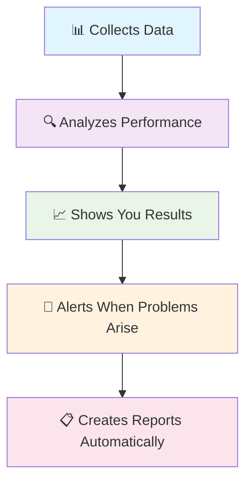
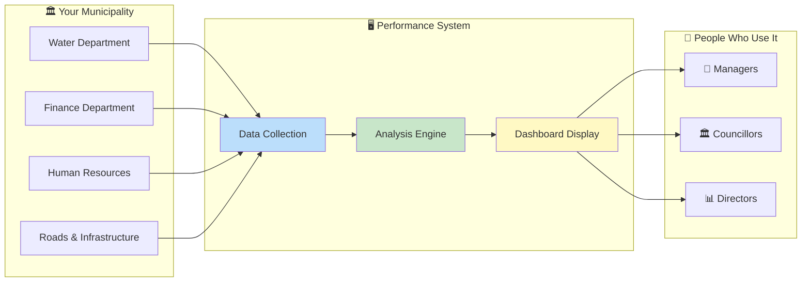
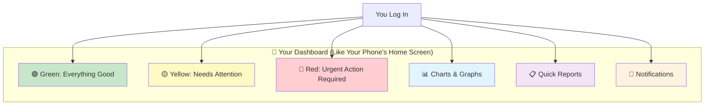
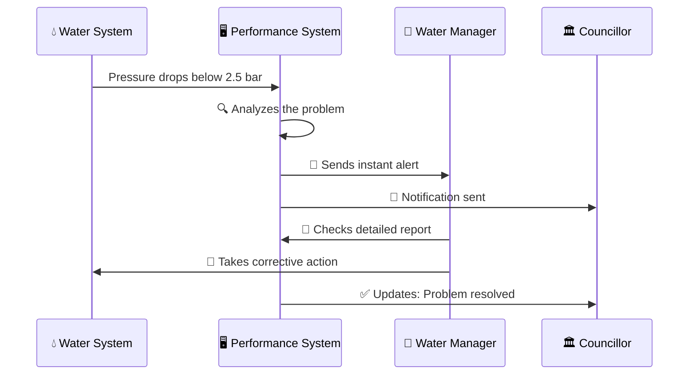
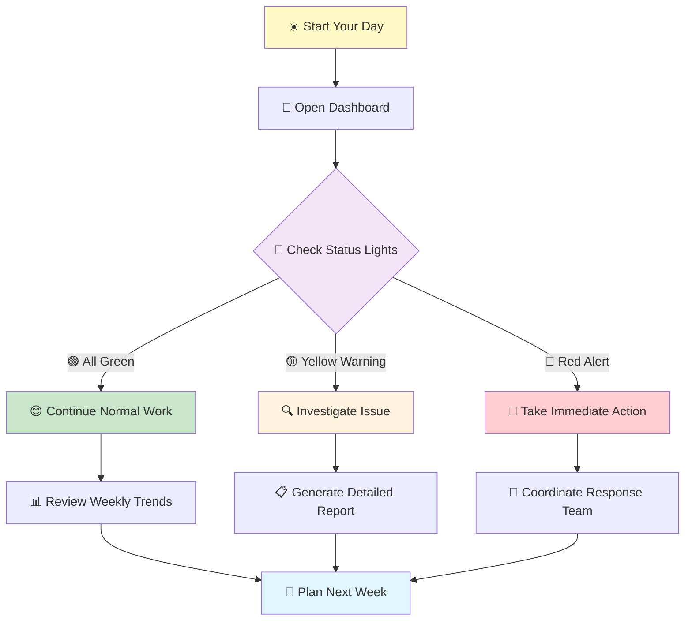
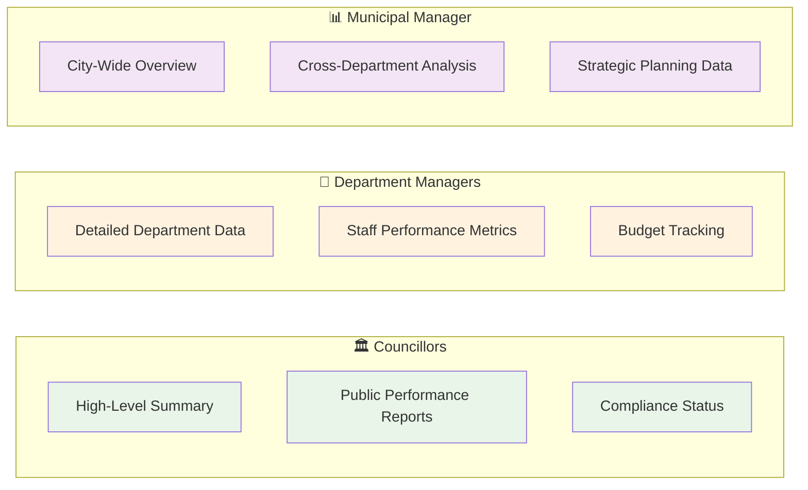
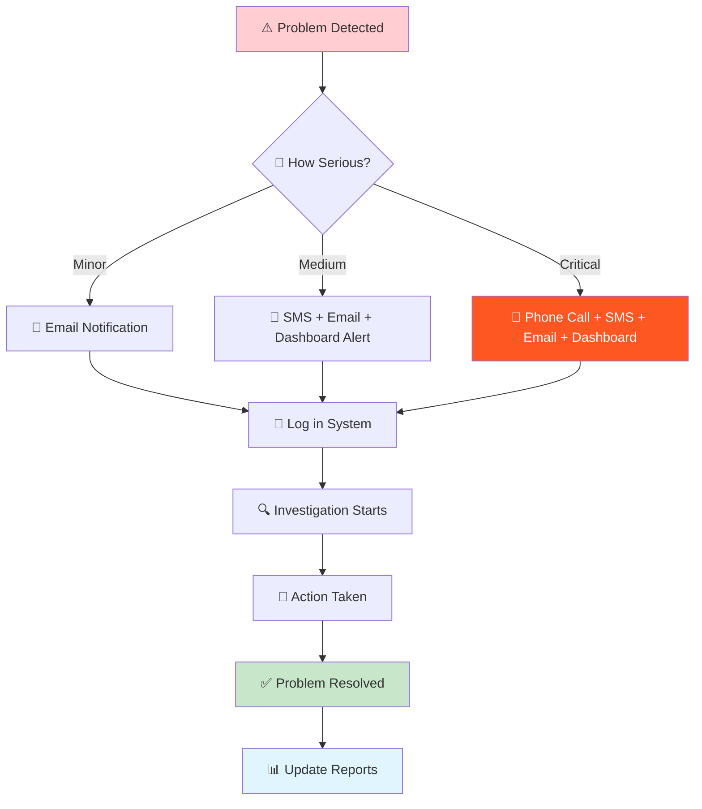
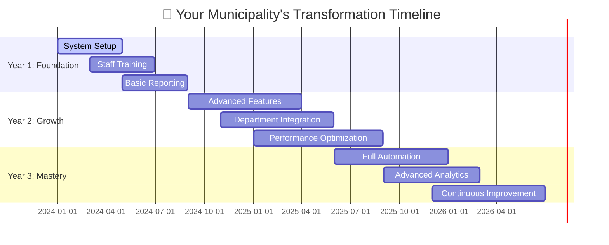
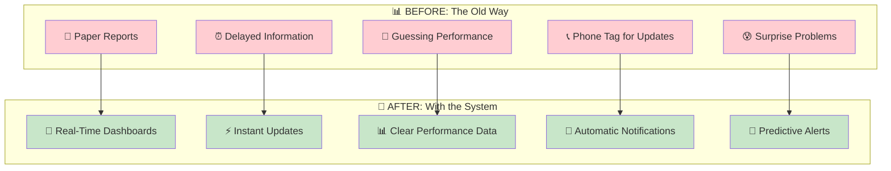
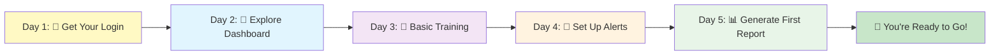

# Municipal Performance Management System
## A Simple Visual Guide for Everyone

Think of this system like a **fitness tracker for your municipality** - it constantly monitors how well your city is performing and helps you stay healthy and compliant.

---

## What Does This System Actually Do?

Just like how your smartphone tracks your steps, heart rate, and sleep - this system tracks your municipality's "vital signs" like service delivery, budget performance, and legal compliance.

---

## The Big Picture: How Everything Works Together

Think of it as a **central nervous system** for your municipality - it connects all departments and gives decision-makers the information they need, when they need it.

---

## What You'll See: Your Personal Dashboard

Your dashboard is like the **control panel of a car** - everything important is visible at a glance, with warning lights when something needs your attention.

---

## Real Example: What Happens When Water Pressure Drops?

It's like having a **smoke alarm for your municipality** - the moment something goes wrong, the right people know about it immediately, along with the information they need to fix it.

---

## Step-by-Step: How You'll Use It Daily

---

## Who Uses What: Different People, Different Views

Think of it like **different TV channels** - everyone gets the same high-quality service, but each person sees the content that's most relevant to their job.

---

## What Happens When Problems Are Detected?

It's like having a **medical emergency system** - minor issues get gentle reminders, but serious problems trigger immediate, multi-channel alerts to ensure nothing gets missed.

---

## The 3-Year Journey: What to Expect

Think of this like **learning to drive** - first you learn the basics, then you get comfortable with all the features, and finally you become an expert who can handle any situation smoothly.

---

## Before and After: The Transformation

---

## Getting Started: Your First Week

Remember: this system is designed to make your life **easier, not harder**. Within a week, you'll wonder how you ever managed without it - just like when you first got a smartphone!

---

## Questions? Think of It This Way...

**"Is this complicated?"** → No! It's like using WhatsApp - once you learn the basics, everything becomes natural.

**"Will this replace my job?"** → No! It's like having a really good assistant who handles the boring stuff so you can focus on important decisions.

**"What if something goes wrong?"** → The system has backup plans, just like your car has spare tires and your phone has battery backup.

This system isn't just about technology - it's about making your municipality run smoother, serve citizens better, and help you do your job with confidence and clear information.